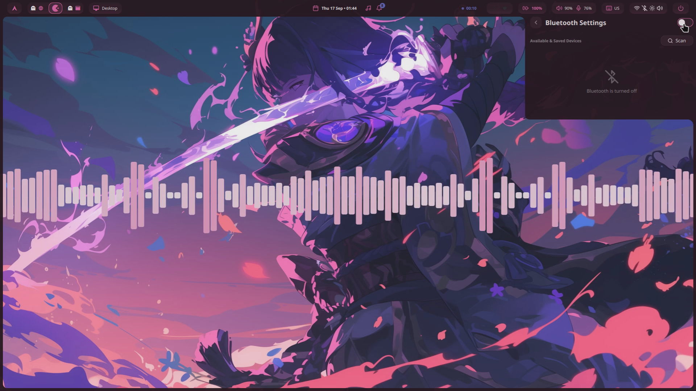

<div align="center">

# 🍒 Cherry's Arch Hyprland Rice

[](https://archlinux.org)
[](https://hyprland.org)
[](https://github.com/outfoxxed/quickshell)
[](https://python.org)
[](https://lua.org)
[](https://fishshell.com)

*A clean, modern, and orchestrative desktop experience crafted for Arch Linux + Hyprland.*

<br />

```text
    ____ _                         ____  _          
   / ___| |__   ___ _ __ _ __ _   |  _ \(_) ___ ___ 
  | |   | '_ \ / _ \ '__| '__| | | | |_) | |/ __/ _ \
  | |___| | | |  __/ |  | |  | |_| |  _ <| | (_|  __/
   \____|_| |_|\___|_|  |_|   \__, |_| \_\_|\___\___|
                               |___/                
```

**Curated & Maintained by Cherry** • [tek-sys-hub/arch-rice](https://github.com/tek-sys-hub/arch-rice)

---

</div>

## 🎬 Showcase & Desktop Demo

<div align=center>
  <video src="assets/arch-recording.mp4" controls="controls" muted="muted" poster="assets/preview.png" width="100%"></video>
  <p>
    <a href="https://raw.githubusercontent.com/tek-sys-hub/arch-rice/main/assets/arch-recording.mp4">
      
    </a>
    <br />
    <em>▶️ <b>Watch the full desktop demonstration:</b> Click image above or view <a href="assets/arch-recording.mp4">assets/arch-recording.mp4</a></em>
  </p>
</div>

---

## 📖 Overview

**Cherry's Arch Rice** is a complete, modular, and dynamic desktop environment built on **Hyprland** (configured using the modern Lua API). The desktop interface is powered by a custom **Quickshell (Qt6/QML)** frontend alongside a high-performance **Python asynchronous daemon**, offering instant live theming, smart workspace switching, interactive control centers, audio visualization, and deep system integration.

All previous imprints and outdated references have been sanitized and cleanly unified under **Cherry**.

---

## ✨ Key Features

- **🚀 Hyprland with Lua API**: Declarative, modular Lua configuration (`hyprland.lua`) split into clean modules (`autostart`, `keybinds`, `windowrules`, `monitors`, `decoration`, `animations`).
- **🔮 Quickshell UI Suite**:
  - **Dynamic Top Bar & Dock**: Interactive workspace indicators, media widget, hardware gauges, and tray.
  - **Control Center (`SUPER + N`)**: Quick toggles for Wi-Fi, Bluetooth, Night Light, Volume, Brightness, and DND.
  - **Desktop Dashboard (`SUPER + D`)**: Productivity hub featuring calendar, upcoming tasks, weather, and system performance.
  - **App Launcher (`SUPER + SPACE`)**: Instant search and desktop application execution.
  - **Terminal Drawer (`SUPER + \``)**: Smooth slide-down scratchpad terminal.
  - **Cherry Lock (`SUPER + L`)**: Integrated PAM-based screen locker with blur and media controls.
- **🎨 Dynamic Theme Engine & 50+ Palettes**:
  - Live wallpaper chroma extraction & theme renderer (`jinja2` template engine).
  - Out-of-the-box support for Catppuccin (Macchiato/Mocha/Latte), Tokyo Night, Rose Pine, Gruvbox, Nord, Dracula, Cyberpunk, and more.
  - Synchronous theming across GTK3/4, Qt apps (via `qtengine`), Kitty, Rofi, Cava, and Bpytop.
- **🖼️ Curated Wallpaper Collection**: High-resolution wallpapers automatically installed to `~/Pictures/Wallpapers` with seamless `awww` transitions.
- **💻 Kitty & Fish Terminal**: Pre-configured with JetBrainsMono Nerd Font, vibrant syntax colors, and Fastfetch system greeting.

---

## 🛠️ Software Stack

| Component | Software / Tool | Purpose |
| :--- | :--- | :--- |
| **Window Manager** | [Hyprland](https://hyprland.org) | Dynamic tiling Wayland compositor |
| **Desktop Shell** | [Quickshell](https://github.com/outfoxxed/quickshell) | Qt6/QML desktop shell (Bar, Control Center, Lock) |
| **Backend Daemon** | Python 3 + Systemd | Socket-activated async daemon for stats & theming |
| **Terminal** | [Kitty](https://sw.kovidgoyal.net/kitty/) | GPU-accelerated Wayland terminal |
| **Shell** | [Fish](https://fishshell.com) | Interactive user shell with custom aliases |
| **App Launcher** | Quickshell / [Rofi](https://github.com/davatorium/rofi) | Fuzzy app launcher and menu provider |
| **Idle & Lock** | [hypridle](https://github.com/hyprwm/hypridle) + Cherry Lock | Screen timeout and session security |
| **Wallpaper Engine** | [awww](https://github.com/phisch/awww) & [mpvpaper](https://github.com/GhostNaN/mpvpaper) | Static wallpaper daemon & hardware-accelerated live video wallpaper engine |
| **Media Processing** | [ffmpeg](https://ffmpeg.org) & mpv | Video frame thumbnail extraction & hardware decode |
| **File Manager** | [Thunar](https://docs.xfce.org/xfce/thunar/start) & [Yazi](https://github.com/sxyazi/yazi) | GUI & Terminal file managers |
| **System Monitors** | [Fastfetch](https://github.com/fastfetch-cli/fastfetch), [btop](https://github.com/aristocratos/btop), [bpytop](https://github.com/aristocratos/bpytop) | Hardware & resource usage monitors |
| **Audio Visualizer** | [Cava](https://github.com/karlstav/cava) | Terminal-based audio spectrum visualizer |
| **Notifications** | Quickshell Notification Center / Dunst | Desktop notifications & OSD |
| **Color Picker** | [hyprpicker](https://github.com/hyprwm/hyprpicker) | Wayland color sampler |
| **Fonts** | JetBrainsMono Nerd Font, Noto Fonts | Monospace & glyph rendering |
| **Icons & Cursor** | Papirus, Bibata-Modern-Ice | Consistent cursor and icon theme |

---

## ⌨️ Keybindings

The `SUPER` key is typically the `Windows` or `Command` key.

### Desktop & UI Controls
| Key Combination | Action |
| :--- | :--- |
| `SUPER + RETURN` | Launch Kitty terminal |
| `SUPER + SPACE` | Toggle App Launcher |
| `SUPER + D` | Toggle Desktop Dashboard |
| `SUPER + N` | Toggle Control Center |
| `SUPER + W` | Toggle Wallpaper Selector |
| `SUPER + SHIFT + W` | Toggle Live Wallpaper Selector |
| `SUPER + T` | Toggle Dynamic Theme Selector |
| `SUPER + L` | Lock Screen (**Cherry Lock**) |
| `SUPER + SHIFT + L`| Suspend system |
| `SUPER + SHIFT + V`| Toggle Clipboard History Manager |
| `SUPER + P` | Area Screenshot Tool |
| `SUPER + SHIFT + P`| Screen Recorder Tool |
| `SUPER + \`` | Toggle Dropdown Terminal Drawer |
| `SUPER + SHIFT + C`| Color Picker (Hex code copied to clipboard) |
| `SUPER + X` | Toggle Power / Session Menu |

### Window Management
| Key Combination | Action |
| :--- | :--- |
| `SUPER + Q` | Close focused window |
| `SUPER + F` | Toggle window Fullscreen |
| `SUPER + V` | Toggle window Floating / Tiling |
| `SUPER + Left / Down / Up / Right` | Move focus (Directional) |
| `SUPER + H / J / K / L` | Move focus (Vim keys) |
| `SUPER + SHIFT + Left / Down / Up / Right` | Swap / Move window in direction |
| `SUPER + 1 .. 0` | Switch to workspace 1 through 10 |
| `SUPER + SHIFT + 1 .. 0` | Move focused window to workspace 1 through 10 |
| `SUPER + Mouse Left Click (Drag)` | Move floating window |
| `SUPER + Mouse Right Click (Drag)` | Resize floating window |

---

## 🚀 Installation

### 1. Clone the Repository
```bash
git clone https://github.com/tek-sys-hub/arch-rice.git ~/Documents/arch-rice
cd ~/Documents/arch-rice
```

### 2. Run the Automated Installer
The provided `install.sh` script handles pre-flight checks, dependency installation, config backups, and systemd service configuration:

```bash
chmod +x install.sh
./install.sh
```

#### Available Flags:
- `-y`, `--yes`: Non-interactive mode (automatically accepts installation prompts).
- `--skip-packages`: Skips pacman and AUR package installations (useful if packages are already installed).
- `--dry-run`: Simulates the installation without modifying any files or installing packages.
- `-h`, `--help`: Displays the help menu.

```bash
# Example: Fast deployment skipping package download
./install.sh --skip-packages -y
```

---

## 📁 Repository Structure

```text
arch-rice/
├── .config/
│   ├── hypr/                 # Hyprland Lua configuration & modules
│   │   ├── hyprland.lua      # Master configuration loader (Cherry imprint)
│   │   ├── hypridle.conf     # Idle rules and lock trigger
│   │   ├── modules/          # Autostart, keybinds, monitors, rules, variables
│   │   └── scripts/          # Workspace helpers & display utilities
│   ├── cherry/              # Quickshell desktop shell suite & Python daemon
│   │   ├── shell/            # QML modules (Bar, ControlCenter, Locker, Dashboard)
│   │   ├── daemon/           # Python async backend daemon (stats, theme extraction)
│   │   ├── templates/        # Jinja2 templates for live cross-app theming
│   │   └── themes/           # 50+ vibrant dark & light JSON color schemes
│   ├── kitty/                # Terminal emulator config & color schemes
│   ├── fish/                 # Fish shell configuration & completions
│   ├── fastfetch/            # Fastfetch ASCII art & system display config
│   ├── waybar/               # Waybar config and theme switching scripts
│   ├── rofi/                 # Application launcher & theme picker menus
│   ├── dunst/                # Dunst notification configuration
│   ├── wlogout/              # Logout / session menu styling
│   ├── cava/                 # Audio visualizer config & shaders
│   ├── btop/                 # System monitor theme & config
│   ├── bpytop/               # Terminal resource monitor theme
│   ├── yazi/                 # Terminal file manager configuration
│   ├── gtk-3.0/ & gtk-4.0/   # GTK styling & Thunar file manager overrides
│   ├── fontconfig/           # Font rendering and fallback rules
│   ├── qtengine/             # Qt styling engine settings
│   └── systemd/user/         # User systemd units (Cherry daemon socket & service)
├── assets/                   # Desktop demo recording and showcase previews
├── wallpapers/               # Curated collection of high-res wallpapers
├── install.sh                # Automated, interactive installer script
├── .gitignore                # Excludes bytecode, temporary logs, and sockets
└── README.md                 # Documentation & installation guide
```

---

## 🎨 Changing Themes & Wallpapers

- **Change Theme On The Fly**: Press `SUPER + T` to open the interactive theme switcher. Select from 50+ color themes or let the daemon dynamically match your wallpaper!
- **Change Static Wallpaper**: Press `SUPER + W` to launch the wallpaper picker, or place pictures in `~/Pictures/Wallpapers/`.
- **Change Live Wallpaper**: Press `SUPER + SHIFT + W` to launch the interactive live wallpaper selector, or place video files (`.mp4`, `.webm`, `.mkv`) into `~/Videos/LiveWallpapers/` or `~/Pictures/Wallpapers/`.
- **Live Wallpaper Performance & Recommended Format**:
  - Resolution: 1080p (1920x1080) or match your native display resolution.
  - Framerate: 30 fps or 60 fps (avoid unnecessarily high 120fps+ video loops for battery and GPU efficiency).
  - Video Codec: H.264 (AVC) or HEVC (H.265) without audio tracks (`-an`).
  - Optimize your videos easily using ffmpeg:
    ```bash
    ffmpeg -i input.mp4 -vf scale=1920:-2 -r 30 -c:v libx264 -crf 22 -preset slow -an output.mp4
    ```
- **Automatic Light / Dark Theming**:
  - In the Wallpaper Switcher, choose between **Auto**, **Light**, or **Dark** mode. In **Auto** mode, the system calculates average perceived luminance and automatically switches your desktop to Light or Dark mode while tinting background surfaces with your wallpaper's primary accent!

---

## 🔧 Post-Installation Notes & Troubleshooting

1. **Quickshell Daemon Socket**:
   The desktop UI communicates with the Python backend via `/tmp/cherry-shell.sock` through systemd socket activation. You can check status anytime:
   ```bash
   systemctl --user status cherry-daemon.socket
   systemctl --user status cherry-daemon.service
   ```
2. **Reloading Quickshell Shell**:
   If you make changes to QML files, you can reload the shell instantly:
   ```bash
   killall quickshell && quickshell > ~/.cache/cherry/quickshell.log 2>&1 &
   ```
3. **Default Shell**:
   To set Fish as your default login shell:
   ```bash
   chsh -s $(which fish)
   ```

---

## 🏷️ Imprint & Credits

- **Author**: Cherry
- **Maintainer**: [tek-sys-hub](https://github.com/tek-sys-hub)
- **License**: MIT
- **Inspirations & Upstream**: Thanks to the Hyprland community and the developers of Quickshell, Kitty, Fish, and Catppuccin.